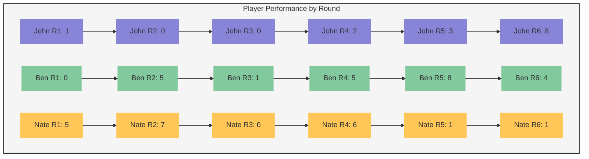

# Offensive Pairings Training Results

## Scoring System
Each player gets 5 opportunities per round. Points are awarded as follows:
- -1 point: Hitting error, block, or hit directly to defender (lack of execution)
- 0 points: Attack in the court that was dug but required a defensive dive
- +1 point: Kill (not in designated zone) or successful tool swing off block
- +2 points: Kill in designated zone
- Maximum score per round: 10 points (5 attempts × 2 points)

## Training Data

| Date | Round | Attack Side | Visual Cue | Location 1 | Location 2 | John | Ben | Nate |
|------|-------|-------------|------------|------------|------------|------|-----|------|
| 2025-02-07 | 1 | Left | Defender | Seam | Sharp Cross | 1 | 0 | 5 |
| 2025-02-07 | 2 | Right | Defender | Seam | Sharp Cross | 0 | 5 | 7 |
| 2025-02-07 | 3 | Left | Blocker | Seam | Hard Line | 0 | 1 | 0 |
| 2025-02-07 | 4 | Right | Blocker | Seam | Hard Line | 2 | 5 | 6 |
| 2025-02-07 | 5 | Right | Blocker | Seam | Hard Line | 3 | 8 | 1 |
| 2025-02-07 | 6 | Left | Live Blocker | Seam | Either Sideline | 8 | 4 | 1 |

## Performance Visualization

### Training Parameters
- Location 1: Always targeting Seam
- Location 2: Varies between Sharp Cross, Hard Line, and Either Sideline
- Visual Cues: Progress from Defender → Blocker → Live Blocker
- Attack Sides: Alternating between Left and Right

### Notes for Future Updates
- Add new practice sessions as new rows in the table
- Update visualization to include new scores
- Date format: YYYY-MM-DD
- Scores range: -5 to 10 (minimum possible: 5 attempts × -1 point)